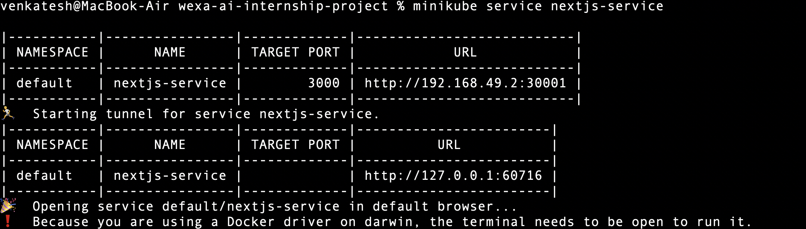

# Next.js App Containerization & Kubernetes Deployment

## Objective
This project demonstrates containerizing a Next.js application, pushing the Docker image to GitHub Container Registry (GHCR), and deploying it on Kubernetes (Minikube).

---

## Folder Structure
.
└── .github/workflows/docker-publish.yml
├── Dockerfile
├── package.json
├── package-lock.json
├── next.config.js
├── pages/
│ ├── index.js
├── public/
├── k8s/
│ ├── deployment.yaml
│ └── service.yaml
├── README.md
├── snapshots
└── .gitignore

---

## Setup Instructions

### Prerequisites
- Node.js installed locally
- Docker installed
- GitHub account
- Minikube installed and running

### Clone the repo
```bash
git clone https://github.com/VenkateshV14/wexa-ai-internship.git
cd wexa-ai-internship
```
### Run docker container locally
```bash
docker build -t next-js:latest .
docker run -d -p 3000:3000 next-js

Access the app at: http://localhost:3000
```

### GHCR Push / GitHub Actions

```bash
- Docker image pushed to GHCR
- Image URL: ghcr.io/venkateshv14/next-js:latest

- GitHub Actions workflow
- File: .github/workflows/docker-publish.yml
- Automatically builds and pushes Docker image to GHCR on push to main branch

```

## Kubernetes Deployment (Minikube)
### Apply Kubernetes manifests
```bash
- kubectl apply -f k8s/deployment.yaml
- kubectl apply -f k8s/service.yaml
```
### Check pods
```bash
- kubectl get pods
```
### Get service URL
```bash
- minikube service nextjs-service

- App opens Automatically in the browser

```


